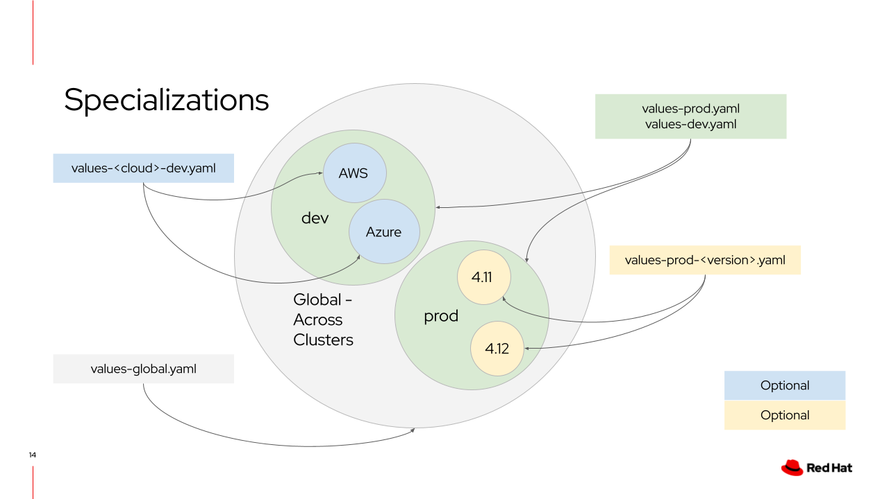

# Chapter 2 - Helm Charts and Their Values

In this chapter, we'll dive deeper into how the Validated Patterns framework
manages Helm chart values through value files, giving you granular control over
your deployments.

## Automatic Value Files

First, let's explore the value files automatically included by the Validated
Patterns framework. We previously encountered one of these automatic value
files: `values-<cluster_group>.yaml`. For example, in our pattern, the cluster
group is named `hub`, making the corresponding file `values-hub.yaml`.

If you inspect the manifests of any application deployed by ArgoCD in the
previous chapter, you'll see that certain value files were automatically applied
based on your specific OpenShift cluster's characteristics. For instance, if
your cluster was deployed on AWS using OpenShift version 4.17, the following
value files would automatically be included:

- `values-global.yaml`
- `values-hub.yaml`
- `values-AWS.yaml`
- `values-AWS-4.17.yaml`
- `values-AWS-hub.yaml`
- `values-4.17-hub.yaml`

The [Validated Patterns Workshop](https://play.validatedpatterns.io/vp-workshop/main/5_validatedpatterns/consumingPatterns-valuesFiles.html#values)
provides an excellent visual representation of these automatically applied
value files, shown below:



In this example, `dev` and `prod` represent different cluster groups, similar
to our `hub` cluster group. This flexibility allows you to precisely target
conditions for when certain values are applied, streamlining your configuration
management.

## Using Value Files in Practice

Now that we've identified the automatically included value files, how can we
leverage them to control Helm chart deployments?

Suppose you add the following configuration to one of your value files listed
above:

```yaml
image: busybox:stable
```

This configuration would cause our simple Helm chart (from Chapter 1) to deploy
the `busybox` image instead of the previously used `http-echo` image. However,
this approach raises a concern: what if another Helm chart also references a
value called `image`? In that scenario, both charts would unintentionally
consume the same `image` value, leading to unexpected deployments.

Sometimes, sharing values across charts is beneficial. For example, in the
Multicloud GitOps Pattern, charts like
[config-demo](https://github.com/validatedpatterns/multicloud-gitops/blob/main/charts/all/config-demo/values.yaml)
and [hello-world](https://github.com/validatedpatterns/multicloud-gitops/blob/main/charts/all/hello-world/values.yaml)
both utilize a common value named `global.hubClusterDomain`. However, other
values—such as replica counts—should typically remain distinct.

To address this, many charts "namespace" their values to prevent unintended
overlaps. For instance, in the
[Medical Diagnosis Pattern](https://github.com/validatedpatterns/medical-diagnosis),
the Kafka chart namespaces its values, referencing them as
`.Values.kafka.replicas`. This technique helps isolate values, but it
requires additional configuration in your Helm charts, potentially introducing
redundancy.

Additionally, namespacing values does not solve the issue of deploying multiple
instances of the same Helm chart with different configurations within one
pattern—each instance would necessarily share the same values.

## Application-Specific Values

To avoid value conflicts and gain precise control over your deployments, you can
specify values or entire value files directly at the application level. The
Validated Patterns framework allows this using special fields:

- **`extraValueFiles`**: Lets you pass additional value files explicitly for
  a specific application.
- **`overrides`**: Enables directly overriding specific Helm values without
  creating separate value files.

In [values-hub.yaml](./values-hub.yaml), you'll find examples demonstrating
how `extraValueFiles` and `overrides` are used to directly modify
application-specific values like the deployed image or container ports. This
approach provides a clear, collision-free method to customize each
application's deployment within your pattern.

Leveraging these mechanisms ensures precise control over your deployments,
maintaining flexibility and clarity within your patterns.

## Redeploying Your Updated Pattern

After making your changes to value files, you'll need to redeploy your pattern.
To do this, update your pattern's Git revision using the following command:

```sh
oc edit patt validated-patterns-guided-tour -n openshift-operators
```

In the editor, set `spec.gitSpec.targetRevision` to `chapter-2`. Save and
close the editor to trigger the update.

Check the "nine dots" menu in your OpenShift console to view the progress of
your deployment. Note that synchronization might take a few minutes.

## Coming Up Next

In [Chapter 3](https://github.com/dminnear-rh/validated-patterns-guided-tour/tree/chapter-2),
we'll explore subscriptions—another powerful mechanism within
Validated Patterns that helps you manage deployments of Operators.
